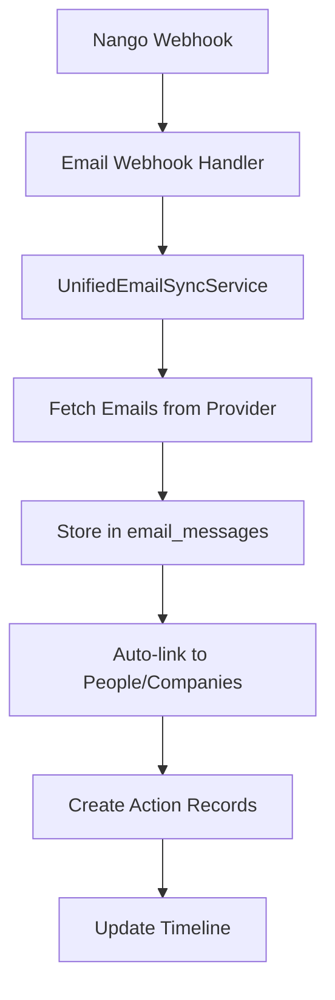

# Email Integration Architecture

## Overview

The Adrata email integration has been modernized to use a unified, Nango-powered approach that provides reliable email syncing, automatic linking to people and companies, and seamless integration with the action timeline.

## Architecture Components

### 1. Database Schema

#### `email_messages` Table
The central table for storing all email data:

```prisma
model email_messages {
  id            String    @id @default(ulid())
  workspaceId   String    @db.VarChar(30)
  
  // Provider info
  provider      String    @db.VarChar(50)  // 'outlook', 'gmail'
  messageId     String    // External message ID
  threadId      String?   // Conversation thread
  
  // Email content
  subject       String
  body          String    @db.Text
  bodyHtml      String?   @db.Text
  
  // Participants
  from          String    @db.VarChar(300)
  to            String[]  @default([])
  cc            String[]  @default([])
  bcc           String[]  @default([])
  
  // Metadata
  sentAt        DateTime
  receivedAt    DateTime
  isRead        Boolean   @default(false)
  isImportant   Boolean   @default(false)
  
  // Rich data (JSON)
  attachments   Json?     // Array of attachment metadata
  labels        String[]  @default([])
  
  // Relationships
  companyId     String?   @db.VarChar(30)
  personId      String?   @db.VarChar(30)
  
  createdAt     DateTime  @default(now())
  updatedAt     DateTime  @updatedAt
  
  workspace     workspaces @relation(fields: [workspaceId], references: [id], onDelete: Cascade)
  company       companies? @relation(fields: [companyId], references: [id])
  person        people?    @relation(fields: [personId], references: [id])
  
  @@unique([provider, messageId, workspaceId])
  @@index([workspaceId])
  @@index([companyId])
  @@index([personId])
  @@index([workspaceId, receivedAt])
  @@index([from])
}
```

### 2. Core Services

#### `UnifiedEmailSyncService`
The main service that handles all email operations:

- **Email Sync**: Fetches emails from connected providers via Nango
- **Auto-linking**: Automatically links emails to people and companies based on email addresses
- **Action Creation**: Creates action records for the unified timeline
- **Data Normalization**: Handles different email provider formats (Outlook, Gmail)

#### `EmailSyncScheduler`
Manages scheduled email synchronization:

- **Batch Processing**: Syncs emails for all active connections
- **Error Handling**: Graceful handling of sync failures
- **Statistics**: Provides sync metrics and monitoring

### 3. API Endpoints

#### `/api/v1/emails`
RESTful API for email data access:

- **GET**: Fetch emails with filtering by person, company, workspace
- **POST**: Create new email messages (for testing/manual entry)
- **Pagination**: Efficient data retrieval with limit/offset
- **Sorting**: Sort by date, importance, read status

#### `/api/webhooks/nango/email`
Webhook endpoint for real-time email notifications:

- **Real-time Sync**: Processes incoming email notifications from Nango
- **Connection Validation**: Verifies active connections before processing
- **Error Handling**: Comprehensive error logging and response

### 4. UI Components

#### `EmailTimelineView`
React component for displaying email timeline:

- **Expandable Cards**: Show email details on demand
- **Provider Icons**: Visual indicators for email source
- **Attachment Support**: Display email attachments
- **Real-time Updates**: Automatic refresh of email data
- **Responsive Design**: Works on all device sizes

## Data Flow

### 1. Email Sync Process



### 2. Email Linking Process

1. **Email Extraction**: Extract email addresses from `from`, `to`, `cc` fields
2. **Person Matching**: Find matching people by email, workEmail, personalEmail
3. **Company Association**: Link to person's company if found
4. **Action Creation**: Create timeline action for linked emails

### 3. Real-time Updates

1. **Nango Webhook**: Provider sends notification of new email
2. **Connection Lookup**: Find workspace and user for the connection
3. **Sync Trigger**: Start email sync process
4. **UI Update**: Timeline components refresh automatically

## Configuration

### Nango Setup

The integration requires Nango to be configured with the following providers:

- **Microsoft Outlook**: For Outlook/Office 365 email accounts
- **Google Gmail**: For Gmail accounts

### Webhook Configuration

Configure Nango webhooks to point to:
```
https://your-domain.com/api/webhooks/nango/email
```

### Scheduled Sync

Set up a cron job to run email sync every 5 minutes:
```javascript
cron.schedule('*/5 * * * *', () => {
  EmailSyncScheduler.scheduleSync();
});
```

## Migration from Legacy System

### What Was Removed

1. **Legacy Services** (5 files):
   - `EmailPlatformIntegrator`
   - `EmailSyncScheduler` (old version)
   - `ComprehensiveEmailLinkingService`
   - `EmailLinkingService`
   - `CompleteActionModel`

2. **Migration Scripts** (60+ files):
   - All email linking scripts
   - Email migration scripts
   - Email processing utilities

3. **Legacy Schema**:
   - `Email` model
   - `ConnectedProvider` model
   - `ProviderToken` model
   - Junction tables (`_EmailToContact`, etc.)

### What Was Added

1. **New Services**:
   - `UnifiedEmailSyncService`
   - `EmailSyncScheduler` (new version)

2. **New API Endpoints**:
   - `/api/v1/emails`
   - `/api/webhooks/nango/email`

3. **New UI Components**:
   - `EmailTimelineView`

4. **Updated Schema**:
   - `email_messages` model in streamlined schema
   - Direct relations to people and companies

## Benefits

### 1. Simplified Architecture
- Single source of truth for email data
- Unified sync process across all providers
- Clean, maintainable codebase

### 2. Improved Reliability
- Nango handles OAuth and API complexity
- Webhook-based real-time updates
- Comprehensive error handling

### 3. Better Performance
- Efficient database queries with proper indexing
- Pagination for large datasets
- Optimized data structures

### 4. Enhanced User Experience
- Real-time email updates
- Rich email display with attachments
- Seamless integration with action timeline

## Monitoring and Maintenance

### Key Metrics

- **Sync Success Rate**: Percentage of successful email syncs
- **Link Rate**: Percentage of emails linked to people/companies
- **Action Creation Rate**: Percentage of emails with timeline actions
- **Response Time**: API endpoint performance

### Health Checks

Run the test script to verify system health:
```bash
node scripts/test-new-email-integration.js
```

### Database Cleanup

Remove legacy tables after confirming new system works:
```bash
psql -d your_database -f scripts/cleanup-legacy-email-tables.sql
```

## Troubleshooting

### Common Issues

1. **No Emails Syncing**:
   - Check Nango connection status
   - Verify webhook configuration
   - Check Grand Central connection records

2. **Emails Not Linking**:
   - Verify email addresses in people records
   - Check email format matching
   - Review auto-linking logic

3. **Performance Issues**:
   - Check database indexes
   - Monitor query performance
   - Review sync batch sizes

### Debug Commands

```javascript
// Check email statistics
const stats = await UnifiedEmailSyncService.getEmailStats(workspaceId);

// Manual sync for workspace
const result = await EmailSyncScheduler.syncWorkspace(workspaceId);

// Check sync statistics
const syncStats = await EmailSyncScheduler.getSyncStats();
```

## Future Enhancements

### Planned Features

1. **Email Templates**: Pre-built email templates for common scenarios
2. **Email Analytics**: Engagement tracking and analytics
3. **Smart Categorization**: AI-powered email categorization
4. **Bulk Operations**: Bulk email operations and management
5. **Advanced Filtering**: Complex email filtering and search

### Integration Opportunities

1. **Calendar Integration**: Link emails to calendar events
2. **Task Management**: Convert emails to tasks automatically
3. **CRM Integration**: Enhanced CRM data from email content
4. **AI Insights**: Extract insights and sentiment from emails

This modernized email integration provides a solid foundation for making Adrata the central action hub for all user communications.
