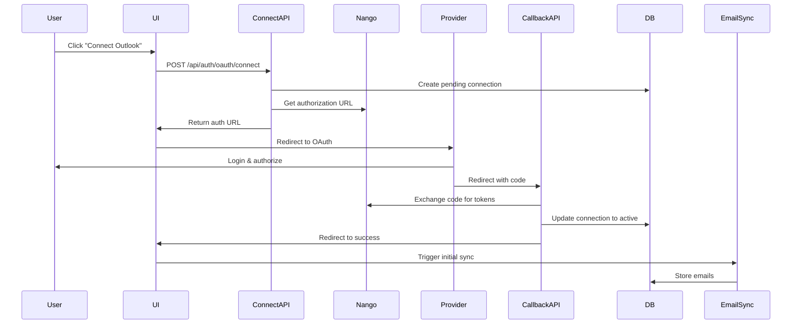

# Grand Central Outlook Integration - Gap Analysis

## Executive Summary

The Grand Central Outlook integration is **85% complete** with solid infrastructure in place. The missing 15% consists primarily of:
1. Missing OAuth connect API endpoint
2. Environment configuration
3. Nango account setup
4. End-to-end testing

## What's Working ✅

### 1. Database Schema
- ✅ `grand_central_connections` table for tracking OAuth connections
- ✅ `email_messages` table with proper indexing
- ✅ Relationship models for linking emails to people/companies
- ✅ Action tracking for timeline integration

### 2. Core Services
- ✅ `UnifiedEmailSyncService` - Email sync with retry logic
- ✅ `NangoService` - Nango SDK wrapper
- ✅ `OAuthService` - OAuth flow management with PKCE
- ✅ Email normalization for Outlook and Gmail
- ✅ Auto-linking emails to people and companies
- ✅ Action creation for timeline

### 3. API Endpoints
- ✅ `/api/v1/integrations/nango/callback` - Nango OAuth callback handler
- ✅ `/api/webhooks/nango/email` - Webhook handler with security
- ✅ `/api/health/email-sync` - Health check and monitoring
- ✅ Webhook signature verification (HMAC-SHA256)
- ✅ Rate limiting (10 req/min per IP)

### 4. UI Components  
- ✅ Grand Central integrations page
- ✅ Connection management UI
- ✅ OAuth flow initiation buttons
- ✅ Connection status display

## What's Missing ❌

### 1. Critical: Missing OAuth Connect Endpoint

**Problem**: The UI calls `/api/auth/oauth/connect` but this endpoint doesn't exist.

**Location**: `src/app/[workspace]/grand-central/integrations/page.tsx:186`
```typescript
const response = await fetch("/api/auth/oauth/connect", {
  method: "POST",
  body: JSON.stringify({
    provider: "microsoft",
    scopes: [...],
    workspaceId: user.activeWorkspaceId,
  }),
});
```

**Impact**: Users cannot initiate Outlook OAuth connection.

**Solution Needed**: Create `src/app/api/auth/oauth/connect/route.ts`

### 2. Environment Configuration

**Missing Variables**:
```bash
NANGO_SECRET_KEY         # Nango secret key
NANGO_PUBLIC_KEY         # Nango public key
NANGO_WEBHOOK_SECRET     # Webhook signature secret
NANGO_HOST               # https://api.nango.dev
MICROSOFT_CLIENT_SECRET  # Azure AD client secret
GOOGLE_CLIENT_SECRET     # Google OAuth secret
OAUTH_REDIRECT_BASE_URL  # https://action.adrata.com
```

**Impact**: Services cannot authenticate with Nango or OAuth providers.

### 3. Nango Account Configuration

**Required Setup**:
- [ ] Create Nango account at nango.dev
- [ ] Configure Microsoft Outlook integration in Nango
- [ ] Configure Google Workspace integration in Nango
- [ ] Set webhook URL: `https://action.adrata.com/api/webhooks/nango/email`
- [ ] Configure redirect URIs in Nango

**Impact**: OAuth flows cannot be initiated through Nango.

### 4. Azure AD Configuration

**Required Setup**:
- [ ] Verify redirect URI: `https://action.adrata.com/outlook/auth_callback/`
- [ ] Verify API permissions:
  - Mail.Read
  - Mail.Send
  - Calendars.ReadWrite
  - User.Read
  - offline_access
- [ ] Ensure admin consent granted

### 5. Dual OAuth Implementation Issue

**Problem**: There are TWO OAuth implementations:
1. **OAuthService** (`src/platform/services/oauth-service.ts`) - Direct OAuth with PKCE
2. **Nango** (`src/app/[workspace]/grand-central/services/NangoService.ts`) - Nango-powered OAuth

**Current State**: The code uses OAuthService but documentation mentions Nango.

**Decision Needed**: Choose one approach:
- **Option A**: Use Nango for simplified OAuth management (recommended)
- **Option B**: Use direct OAuth with OAuthService (more control)

## Architecture Confusion Points

### 1. Multiple Callback Handlers

There are TWO OAuth callback handlers:
- `/api/auth/oauth/callback` - Used by OAuthService
- `/api/v1/integrations/nango/callback` - Used by Nango

**Current Flow**: Unclear which is active.

### 2. Connection Storage Discrepancy

- OAuthService doesn't create `grand_central_connections` records
- Nango connect endpoint DOES create records
- UnifiedEmailSyncService expects connections in database

**Gap**: OAuthService flow won't create necessary database records.

## Recommended Architecture

### Unified OAuth Flow (Nango-Based)



## Implementation Plan

### Phase 1: Create Missing Endpoint (30 minutes)

Create `src/app/api/auth/oauth/connect/route.ts`:

```typescript
import { NextRequest, NextResponse } from 'next/server';
import { OAuthService } from '@/platform/services/oauth-service';
import { getUnifiedAuthUser } from '@/platform/auth/unified-auth-utils';
import { prisma } from '@/lib/prisma';

export const dynamic = 'force-dynamic';

export async function POST(request: NextRequest) {
  try {
    const user = await getUnifiedAuthUser(request);
    if (!user) {
      return NextResponse.json({ error: 'Unauthorized' }, { status: 401 });
    }

    const { provider, scopes, workspaceId } = await request.json();

    if (!provider || !workspaceId) {
      return NextResponse.json(
        { error: 'Provider and workspaceId are required' },
        { status: 400 }
      );
    }

    // Initiate OAuth flow
    const result = await OAuthService.initiateOAuth(
      provider,
      scopes,
      workspaceId,
      user.id
    );

    if (!result.success) {
      return NextResponse.json(
        { error: result.error || 'Failed to initiate OAuth' },
        { status: 500 }
      );
    }

    // Create pending connection record
    await prisma.grand_central_connections.create({
      data: {
        workspaceId,
        userId: user.id,
        provider,
        providerConfigKey: provider,
        nangoConnectionId: result.state, // Use state as connection ID
        connectionName: `${provider} Connection`,
        status: 'pending',
        metadata: {
          authUrl: result.authorizationUrl,
          createdAt: new Date().toISOString()
        }
      }
    });

    return NextResponse.json({
      success: true,
      authorizationUrl: result.authorizationUrl,
      state: result.state
    });

  } catch (error) {
    console.error('Error initiating OAuth:', error);
    return NextResponse.json(
      { error: 'Failed to initiate OAuth flow' },
      { status: 500 }
    );
  }
}
```

### Phase 2: Environment Setup (1-2 hours)

1. **Nango Account Setup**:
   ```bash
   # Sign up at https://nango.dev
   # Create new project
   # Add Microsoft Outlook integration
   # Get API keys
   ```

2. **Set Environment Variables in Vercel**:
   ```bash
   vercel env add NANGO_SECRET_KEY
   vercel env add NANGO_PUBLIC_KEY
   vercel env add NANGO_WEBHOOK_SECRET
   vercel env add MICROSOFT_CLIENT_SECRET
   ```

3. **Configure Nango Webhook**:
   - URL: `https://action.adrata.com/api/webhooks/nango/email`
   - Secret: Same as NANGO_WEBHOOK_SECRET
   - Events: `email.received`, `email.sent`

### Phase 3: Testing (1-2 hours)

1. **Health Check**:
   ```bash
   curl https://action.adrata.com/api/health/email-sync
   ```

2. **OAuth Connection**:
   - Navigate to Grand Central → Integrations
   - Click "Connect" on Microsoft Outlook
   - Complete OAuth flow
   - Verify connection appears as "Active"

3. **Email Sync**:
   - Trigger manual sync or wait for webhook
   - Check database for emails:
     ```sql
     SELECT COUNT(*) FROM email_messages;
     SELECT COUNT(*) FROM grand_central_connections WHERE status = 'active';
     ```

4. **Webhook Test**:
   ```bash
   # Use Nango's webhook testing tool
   # Or send test email to connected account
   ```

### Phase 4: Monitoring (Ongoing)

1. **Check Health Endpoint Daily**:
   ```bash
   curl https://action.adrata.com/api/health/email-sync | jq .
   ```

2. **Monitor Key Metrics**:
   - OAuth success rate > 95%
   - Email sync success rate > 99%
   - Email linking rate > 50%
   - Average sync latency < 30s

3. **Review Logs**:
   ```bash
   vercel logs --prod | grep -i "email\|oauth\|nango"
   ```

## Alternative: Nango-Only Approach

If you prefer to use Nango exclusively (cleaner approach):

### Changes Required:

1. **Update UI to use Nango endpoint**:
   ```typescript
   // Change from /api/auth/oauth/connect
   // To: /api/v1/integrations/nango/connect
   const response = await fetch("/api/v1/integrations/nango/connect", {
     method: "POST",
     body: JSON.stringify({
       provider: "microsoft-outlook", // Nango provider key
       workspaceId: user.activeWorkspaceId,
     }),
   });
   ```

2. **Update Nango callback redirect**:
   ```typescript
   // In Nango dashboard, set callback URL:
   https://action.adrata.com/api/v1/integrations/nango/callback
   ```

3. **Configure Nango provider keys**:
   - Outlook: `microsoft-outlook`
   - Gmail: `google-mail`

## Security Checklist

- [x] Webhook signature verification implemented
- [x] Rate limiting on webhook endpoint
- [x] PKCE for OAuth flows
- [x] Secure token storage
- [ ] Environment variables set
- [ ] OAuth scopes minimized
- [ ] User consent flow tested
- [ ] Error handling doesn't leak sensitive data

## Testing Checklist

- [ ] Health check endpoint returns 200
- [ ] OAuth connect button redirects to Microsoft login
- [ ] OAuth callback processes successfully
- [ ] Connection appears in Grand Central UI
- [ ] Email sync retrieves emails
- [ ] Emails linked to people/companies
- [ ] Actions created for timeline
- [ ] Webhook receives notifications
- [ ] Rate limiting works
- [ ] Error scenarios handled gracefully

## Estimated Completion Time

- **Missing endpoint**: 30 minutes
- **Environment setup**: 1-2 hours
- **Nango configuration**: 1-2 hours
- **Testing**: 1-2 hours
- **Total**: 4-6.5 hours

## Current Status: 85% Complete

**Remaining Work**:
- 10% - Missing API endpoint
- 3% - Environment configuration  
- 2% - Testing and validation

## Next Immediate Steps

1. Create `/api/auth/oauth/connect/route.ts` endpoint
2. Set up Nango account
3. Configure environment variables
4. Test OAuth connection flow
5. Verify email sync works

## Support Resources

- **Nango Documentation**: https://docs.nango.dev
- **Microsoft Graph API**: https://docs.microsoft.com/graph/auth-v2-user
- **Existing Scripts**:
  - `scripts/validate-environment.js` - Check env vars
  - `scripts/test-email-integration-production.js` - Integration tests

## Questions to Answer

1. **Use Nango or Direct OAuth?**
   - Recommendation: Nango (simpler, more maintainable)

2. **Test in staging first?**
   - Recommendation: Yes, set up staging Nango project

3. **Who manages Nango account?**
   - Needs owner designation

4. **Alert strategy for failures?**
   - Recommendation: Use health endpoint + monitoring service

